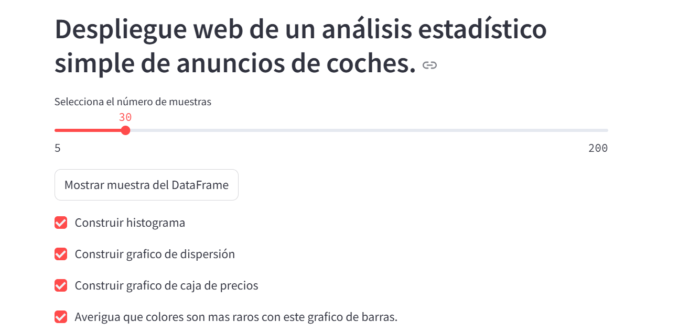
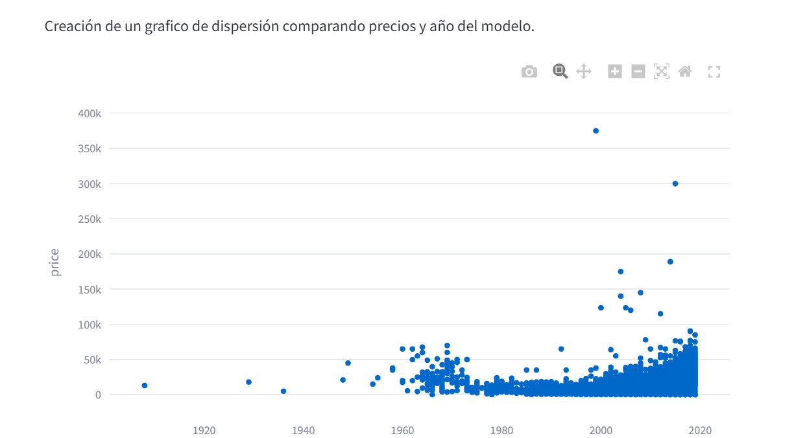
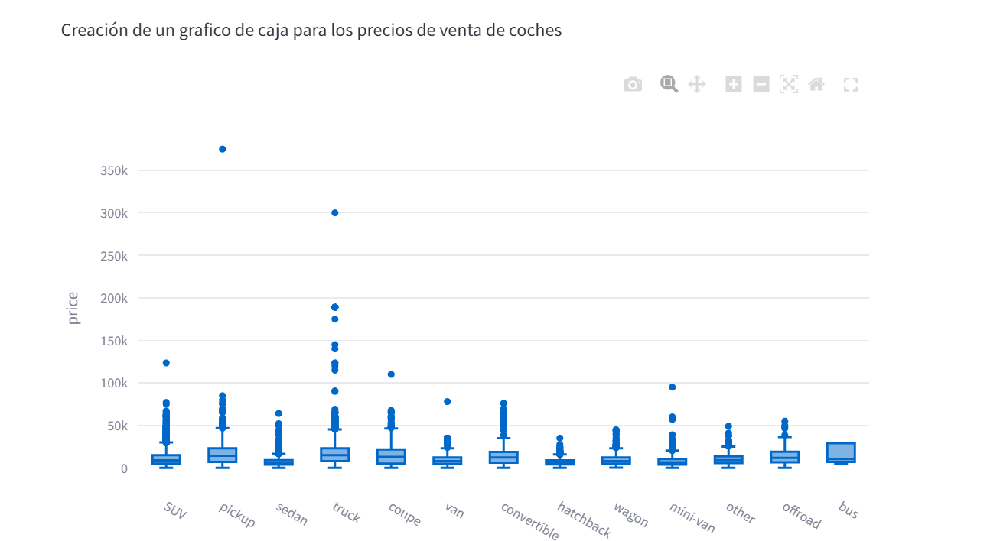

# 🔗 Proyecto Sprint 5: Herramientas de desarrollo de software

**Objetivo del proyecto:**  
Crear un dashboard de análisis estadístico e implementarlo en un servicio en la nube para hacerlo accesible al público.  
Este proyecto combina análisis exploratorio, visualización y despliegue web de una aplicación interactiva.

## Skills 🛠:
- 🧰 Herramientas de desarrollo de software  
- 🐍 Python  
- 📉 Análisis estadístico  
- 📊 Análisis exploratorio  

---

## Descripción del proyecto

Esta aplicación web muestra un análisis estadístico básico sobre un conjunto de datos de venta de automóviles.  
Fue implementada utilizando Streamlit y desplegada a través de Render, con integración continua desde GitHub.

---

## 🌐 Funcionalidades de la App

- Visualización aleatoria del DataFrame  
- Histograma de valores del odómetro  
- Gráfico de dispersión precio vs. año  
- Gráfico de cajas por tipo de coche y precio  
- Histograma por color del coche  

---

## 🚀 App desplegada

Aquí se encuentra la imagen de vista previa de la aplicación:

